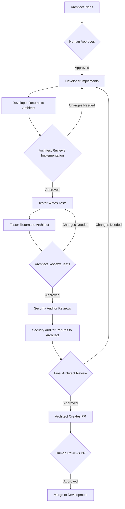
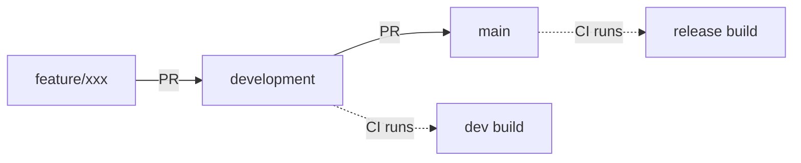

# Human-in-the-Loop Workflow

This project uses a Human-in-the-Loop (HITL) approval workflow. Specialist subagents plan, develop, test, and audit code.

## ⚠️ HARD GATE: NEVER SKIP STEP 2

**You MUST NOT create, edit, or modify any code files until the human has explicitly approved an architect's plan.** Operational tasks (starting services, running commands, reading files) are exempt. Everything else requires: architect plans -> human approves -> developer implements.

## Workflow

This project uses a Human-in-the-Loop (HITL) approval workflow with **architect as coordinator**. Each stage returns to the architect for review before proceeding to the next.



### Step-by-Step Process

1. **Architect Plans**
   - Explores codebase and produces implementation plan
   - Creates GitHub issue with WHY/WHAT/HOW template: `./scripts/create-issue.sh --create-branch`
   - Branch `issue/{number}-{slug}` is automatically created from the issue
   - Notifies human: `./scripts/workflow-notify.sh plan-ready "plan ready for review"`

2. **Human Reviews and Approves** — **HARD GATE**
   - **Option A**: Comment `approved` on the issue, then run `./scripts/watch-approval.sh`
   - **Option B**: Approve in chat, then run `./scripts/workflow-notify.sh approved "developer starting"`

3. **Developer Implements**
   - Switches to issue branch: `git checkout issue/{number}-{slug}`
   - Implements code changes following approved plan
   - Works autonomously, presents completed work for review
   - Notifies architect: `./scripts/workflow-notify.sh impl-done "ready for review"`

4. **Architect Reviews Implementation**
   - Reviews code against plan and clean architecture principles
   - If approved, passes to tester
   - If changes needed, returns to developer

5. **Tester Writes Tests**
   - Writes and runs tests to validate changes
   - Works autonomously, presents completed test results
   - Notifies architect: `./scripts/workflow-notify.sh tests-done "test results ready"`

6. **Architect Reviews Tests**
   - Reviews test coverage and quality
   - If approved, passes to security auditor
   - If changes needed, returns to tester

7. **Security Auditor Reviews**
   - Inspects code for vulnerabilities (OWASP Top 10, injection, auth flaws)
   - Read-only — cannot modify code
   - Notifies architect: `./scripts/workflow-notify.sh audit-done "audit complete"`

8. **Final Architect Review**
   - Reviews all work (implementation + tests + security audit)
   - If approved, creates PR targeting `development`
   - If changes needed, returns to appropriate stage
   - **Human reviews and merges the PR to `development`**

### Memory Aid: YOU ALWAYS FORGET THE HITL GATE

You have a pattern of treating "small" or "obvious" code changes as exempt from the HITL workflow. **This is incorrect.** The following examples ARE code changes that require architect → issue → approval:

- Adding/changing tests (widget, unit, integration)
- Modifying source files for any reason (even "obvious" fixes)
- Adding configuration files (CI config, analysis_options.yaml)
- Installing packages — these modify `pubspec.yaml`
- Creating or modifying `.gitignore`, `.editorconfig`, or any non-README file

**The only exempt operations are:**
- Running commands that don't create or edit files (`flutter`, `dart`, `curl`)
- Reading files, searching, exploring
- Starting/stopping services

> **Rule of thumb:** If it touches a tracked or tracked-adjacent file, it needs an issue and approval. "But it's small!" is not an exemption — it's the exact rationalization that has caused every previous violation.

## Agent Roles

### `@architect`
Read-only analyst. Explores the codebase, understands existing patterns, and produces structured implementation plans by creating GitHub issues for tracking. Plans must include estimated AI time (time the AI will spend implementing the complete flow) and estimated token usage. Cannot edit files or run commands.

> **Notification gate**: When the plan is ready (issue created/updated), run:
> ```bash
> ./scripts/workflow-notify.sh plan-ready "plan ready for review"
> ```
>
> After notifying, **run `watch-approval.sh`** to block until the human approves:
> ```bash
> ./scripts/watch-approval.sh
> ```
> This polls the issue every 10s for `approved`/`lgtm`/`looks good`/`go ahead`. On detection, it notifies and exits 0. Only then may the developer begin implementation.

### `@developer`
Implements code changes. Edits source files and runs build/compile commands autonomously. When work is complete, presents a summary of all changes and asks for human review. On failure, retries up to 3 times before escalating to the user.

> **Notification gate**: When implementation is done and review is requested, run:
> ```bash
> ./scripts/workflow-notify.sh impl-done "ready for review"
> ```
>
> **IMPORTANT**: After notification, **do not proceed directly to testing**. Wait for the architect to review your work and either approve (pass to tester) or request changes (return to developer).

### `@tester`
Writes and runs tests. Edits test files and executes test commands autonomously. When tests are complete, presents results and asks for human review. On failure, retries up to 3 times before escalating to the user.

> **Notification gate**: When tests are done and results are presented, run:
> ```bash
> ./scripts/workflow-notify.sh tests-done "test results ready"
> ```

### `@security-auditor`
Security reviewer. Inspects code for OWASP Top 10, injection risks, authentication flaws, and sensitive data exposure. Read-only — cannot modify code or run commands.

> **Notification gate**: When security audit is complete, run:
> ```bash
> ./scripts/workflow-notify.sh audit-done "audit complete"
> ```

### `@ux-ui`
Read-only reviewer. Reviews Flutter widget trees, screen layouts, navigation flows, accessibility semantics, visual consistency, and user-facing interaction patterns. Can produce UI mockups/specs using PlantUML (already in the toolchain).

**Capabilities:**
- Review widget hierarchy for accessibility (semantic labels, focus order, screen reader support)
- Evaluate layout responsiveness and visual consistency
- Review user flows and navigation patterns
- Suggest improvements for onboarding, error states, loading states, and empty states
- Ensure adherence to Material Design (or chosen design system) guidelines
- Cannot edit files or run commands

> **Notification gate**: When UX/UI review is complete, run:
> ```bash
> ISSUE_NUM=$(gh issue list --label enhancement --state open --json number --jq '.[0].number')
> ISSUE_URL="https://github.com/nmwael/subvocal/issues/$ISSUE_NUM"
> ./scripts/notify.sh "UX/UI review done" "Issue #$ISSUE_NUM: $(gh issue view "$ISSUE_NUM" --json title --jq '.title') — review complete" "$ISSUE_URL"
> ```

## Reference Books by Role

All reference books sourced from https://github.com/ciembor/agent-rules-books/

- **All agents**: library/release-it.mini.md — Release It! patterns for production-ready systems
- **@architect**: library/architect/clean-architecture.mini.md, library/architect/patterns-of-enterprise-application-architecture.mini.md, library/architect/domain-driven-design-distilled.mini.md — architecture and design patterns
- **@developer**: library/developer/clean-code.mini.md, library/developer/refactoring.mini.md — code quality and refactoring
- **@tester**: library/developer/clean-code.mini.md, library/developer/refactoring.mini.md — readable tests and safe refactoring
- **@security-auditor**: all library — security review benefits from understanding the full design intent
- **@ux-ui**: library/ux-ui/material-design-3.mini.md, library/ux-ui/ui-patterns.mini.md — UI design systems and interaction patterns

## Commit Rules

- Never stage, commit, or push changes unless the user explicitly requests it
- Do not run `git add`, `git commit`, or `git push` commands autonomously
- **Always use helper scripts for git operations** — never run raw `git add`, `git commit`, or `git push`. Use `./scripts/commit-push.sh` (handles staging, signed commit, and push). Use `./scripts/check-branch.sh` for status. Scripts handle GPG checks, conventional commit prefixes, and error handling that raw commands miss. If a script fails mid-way (e.g., GPG timeout), fix the issue and re-run the full script — do not fall back to raw `git commit` or `git push` to "finish up"
- If the user asks about the state of work, use `./scripts/check-branch.sh` or show a diff instead
- If a signed commit fails despite a prepared token, it is likely the human needs to press the hardware button — inform the user rather than retrying or skipping the signature
- Commit messages must be prefixed with a conventional commit type: `doc:` (documentation), `chore:` (tooling/config), `feat:` (feature), `fix:` (bug fix), `refactor:` (code restructuring), `test:` (test changes), or other types as appropriate

## Retry Rules

- On failure (build error, test failure, validation rejection), retry up to 3 attempts
- After 3 failed attempts, stop and present the failure to the user with diagnostic information
- Do not keep retrying without informing the user

## Rules

- Before starting work, read this file and understand the workflow
- After completing a task, provide a clear summary of what was done
- If a plan would benefit from another agent's review, delegate via the Task tool
- Never bypass the HITL approval gate by using a subagent to indirectly perform a denied action
- Never develop directly on `main` or `development`. All work must be done in a dedicated feature branch
- **Never merge issue branches locally into `development`** — always create a PR and let the human merge via GitHub (see "LESSON LEARNED" under Branching Strategy)
- **All features must have tests before merging** — unit tests for domain/data logic, widget tests for UI components, integration tests for critical user flows

## Branching Strategy



| Branch | Purpose | Who merges | CI |
|---|---|---|---|
| `main` | Production releases only | Human (manual PR from `development`) | Release build + pages deploy |
| `development` | Integration branch — all PRs target here | Human (after CI passes) | Full CI (analyze + test + integration) |
| `issue/*` | Issue-driven work branches | PR to `development` | CI runs on PR |

- **PRs always target `development`**, never `main` directly
- **`main` is production** — only merged from `development` when ready to release
- **Development builds must always work** — CI enforces this on every push/PR to `development`
- **Issue branches** are created from GitHub issues: `issue/{number}-{slug}`
- Use `./scripts/sync-main.sh` (defaults to `development`) to keep feature branches up to date

### ⚠️ LESSON LEARNED: Never merge issue branches locally into development

**The correct workflow is always:**

```
issue branch → implement → push branch → create PR → merge via GitHub
```

**The WRONG workflow (causes orphaned branches, missing PR trail):**

```
issue branch → implement → merge locally → push development
```

After implementing on an issue branch, you MUST:
1. Push the issue branch: `git push -u origin <branch>`
2. Create a PR from the issue branch targeting `development`: `./scripts/pr-create.sh`
3. Let CI run and the human merge via GitHub

**Never** `git merge <issue-branch>` locally into `development` and push. This creates orphaned branches with no PR trail and breaks the HITL review process.

### PRE-FLIGHT CHECK (MANDATORY BEFORE ANY CODE CHANGE)

When a user requests any task that involves creating, editing, or modifying code:

1. **STOP** — do not edit or create any files.
2. **CLASSIFY** — is this an operational task (running commands, reading files, starting services) or a code change? Operational tasks are exempt.
3. **IF code change** — route through the architect agent. The architect must explore, produce a plan, create a GitHub issue, and present it to the user for approval.
4. **WAIT** for explicit human approval (e.g., "approved", "lgtm", "looks good", "go ahead") before implementing.
5. **Only then** implement using the developer agent or directly.

If the user asks you to "just do it" or bypasses the gate, refuse politely and explain that step 2 is required.

### PRE-TASK RITUAL (DO NOT SKIP)

Before every response that involves code, forcibly re-read the Memory Aid section above and confirm to yourself: "Is this a code change that needs HITL?" If the answer is ambiguous, treat it as needing HITL. Only if every touched file is definitively exempt (read-only command, no file creation/editing) may you proceed.

## GPG / Signed Commits

The project requires signed commits via a hardware token. The devcontainer forwards the GPG agent socket from the host.

### How it works
- The host GPG agent socket is bind-mounted into the container at `~/.gnupg/S.gpg-agent`
- `gpg --card-status` may report "Forbidden" inside the container, but **signing still works** because the socket delegates to the host's `scdaemon`
- When prompted for a PIN during signing, the host's `pinentry` program will pop up on the host machine

### Committing with a signed commit
```bash
# Use the helper script (recommended)
./scripts/commit-push.sh --all -m "type: message"

# Or manually
git add -A
git commit -S -m "type: message"
git push
```

### Troubleshooting
- If `gpg --card-status` says "Forbidden" or "No card", try the commit anyway — signing may still work via the forwarded socket
- If the commit hangs, check the host machine for a `pinentry` pop-up requesting your smartcard PIN
- If `gpg --card-status` says "No such device" or "No card" and the commit also fails, the hardware token socket is not forwarded. Recreate the devcontainer with GPG forwarding enabled
- To verify a commit was signed: `git log --show-signature -1`

## Devcontainer Environment

This project runs in a devcontainer with the following setup:

- **Container base**: Debian Bullseye (`mcr.microsoft.com/devcontainers/base:bullseye`)
- **Flutter**: Installed via devcontainer feature (`ghcr.io/awf-project/devcontainer-features/flutter:1`), latest stable channel
- **Dart**: Bundled with Flutter SDK
- **GitHub CLI (`gh`)**: Authenticated and available. Use `echo "$AI_FUN_TOKEN" | gh auth login --with-token` if re-authentication is needed. The token is a GitHub fine-grained PAT stored in the `AI_FUN_TOKEN` environment variable.
- **Development**: Run `flutter pub get` in project root, then `flutter run` to launch on connected device/emulator
- **Android emulator**: Not available in devcontainer; test on physical device or use `flutter build apk --debug` and side-load

## Diagram Convention

When architecture diagrams are required in documentation (e.g., DEVELOPMENT.md), use Mermaid fenced code blocks with ````mermaid` syntax. This ensures diagrams are renderable by Mermaid-compatible tools and remain readable as plain text.

## Pull Requests

**All PRs must target `development`, never `main`.** The `main` branch is production-only. When creating a PR, always use `--base development` or the `pr-create.sh` script which defaults to `development`.

When approved work is ready to merge, @architect generates a pull request with a descriptive title and a "WHY WHAT HOW" template body:

### WHY
Why is this change needed? What problem does it solve?

### WHAT
What was changed? Briefly list the major changes.

### HOW
How does the implementation work? Key design decisions and architecture notes.

## Project Summary

### Goal
Cross-platform Flutter app for picking subtitles from OpenSubtitles, SubDL, or Podnapisi and reading them aloud via TTS in sync with streaming video (Netflix, Prime, etc.). Useful for accessibility (visually impaired) and language learning.

### Key Decisions
- **Clean Architecture**: Domain (SRT parsing, TTS orchestration) independent from Flutter framework and API details
- **Riverpod**: State management — simpler than BLoC, compile-safe, good for solo dev
- **Custom SRT parser**: SRT format is simple; avoids dependency risk
- **flutter_tts**: Wraps platform TTS (Android TTS / iOS AVSpeechSynthesizer)
- **Multiple subtitle providers**: OpenSubtitles (primary), SubDL (2,000 req/day free), Podnapisi (zero auth, 2.2M+ subtitles)
- **Provider aggregator**: Searches all providers, deduplicates results, provides fallback
- **SRT-timed utterance scheduling**: Calculate delays between subtitle entries from timestamps

### Relevant Files
- `AGENTS.md`: This file — HITL workflow
- `DEVELOPMENT.md`: Development setup guide
- `library/`: Reference books organized by role (architect/, developer/, ux-ui/, shared)

## Tooling Preferences

- **Dart analysis**: Use `dart analyze` for static analysis. Run `dart fix --dry-run` before `dart fix --apply`.
- **Flutter tests**: Use `flutter test` for unit/widget tests. For integration tests, use `flutter test integration_test/`.
- **Code formatting**: Use `dart format` (not Prettier for Dart files).

## Helper Scripts

All scripts are in `scripts/` and accept `--help` for usage. Use these instead of inline bash — they save tokens and reduce errors.

### Workflow
| Script | Purpose |
|---|---|
| `notify.sh` | Send a notification (called by other scripts) |
| `watch-approval.sh` | Poll an issue for human approval |
| `workflow-notify.sh` | Look up latest issue + send workflow notification |
| `create-issue.sh` | Create a GitHub issue with WHY/WHAT/HOW template |
| `create-branch-from-issue.sh` | Create branch `issue/{number}-{slug}` from a GitHub issue |
| `pr-create.sh` | Create a pull request with WHY/WHAT/HOW template (targets `development` by default) |

### Code Quality
| Script | Purpose |
|---|---|
| `analyze.sh` | Run `dart analyze` with optional `--fix` and `--format` |
| `run-tests.sh` | Run tests by category (`--unit`, `--widget`, `--integration`, `--file`, `--all`) |
| `run-checks.sh` | Run all pre-commit checks (analyze + tests) in one shot |
| `check-references.sh` | Search for stale text references across codebase |

### Git & CI
| Script | Purpose |
|---|---|
| `commit-push.sh` | Stage, signed commit (`-S`), push — with `--dry-run` support |
| `check-branch.sh` | Show branch status, ahead/behind, uncommitted changes |
| `sync-main.sh` | Rebase or merge current branch onto `development` |
| `ci-status.sh` | Show latest CI runs, download artifacts with `--artifacts` |
| `download-ci-artifacts.sh` | Download test artifacts from a specific or latest CI run |

### FinOps (AI Cost Tracking)
| Script | Purpose |
|---|---|
| `log-usage.sh` | Log token usage from OpenCode DB to `.aifinops/log.csv` (auto-called by `workflow-notify.sh` at task boundaries) |
| `usage-report.sh` | Generate usage reports (`--by-agent`, `--by-model`, `--by-issue`, `--summary`, `--json`) |

**How it works**: OpenCode tracks per-message `cost` and `tokens` (input/output/reasoning/cache) in its SQLite database (`~/.local/share/opencode/opencode.db`). The `session` table has pre-aggregated totals. `log-usage.sh` reads this data and appends a CSV row to `.aifinops/log.csv`.

**Auto-logging**: `workflow-notify.sh` automatically calls `log-usage.sh` after `impl-done`, `tests-done`, `audit-done`, and `ux-done` notifications. No manual action needed.

**Manual logging**: `./scripts/log-usage.sh [--session-id ID] [--issue NUM] [--agent ROLE] [--dry-run]`

**Reporting**: `./scripts/usage-report.sh --summary` or `--by-agent` or `--by-model`

### Quick Reference

```bash
# Create issue + branch + notify
./scripts/create-issue.sh --title "Add X" --why "Need it" --what "Added X" --how "Via Y" --notify --create-branch

# Create branch from existing issue
./scripts/create-branch-from-issue.sh --issue 42 --title "add-subtitle-search"

# Run pre-commit checks
./scripts/run-checks.sh --format

# Push a signed commit
./scripts/commit-push.sh --all -m "description" --type fix

# Check for stale references
./scripts/check-references.sh "old button text" --paths lib,test

# See CI status + download artifacts
./scripts/ci-status.sh --artifacts

# Sync branch with main
./scripts/sync-main.sh --rebase

# Create PR (targets development by default)
./scripts/pr-create.sh --title "feat: Add X" --why "..." --what "..." --how "..."
```
