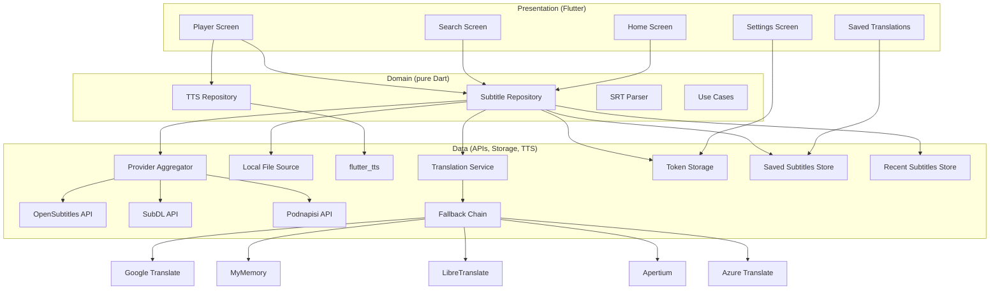
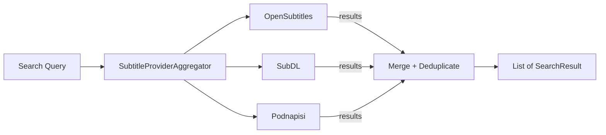
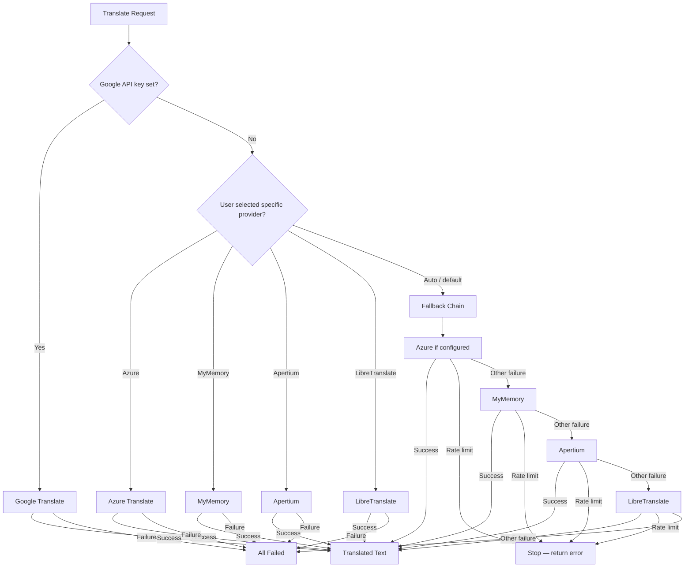
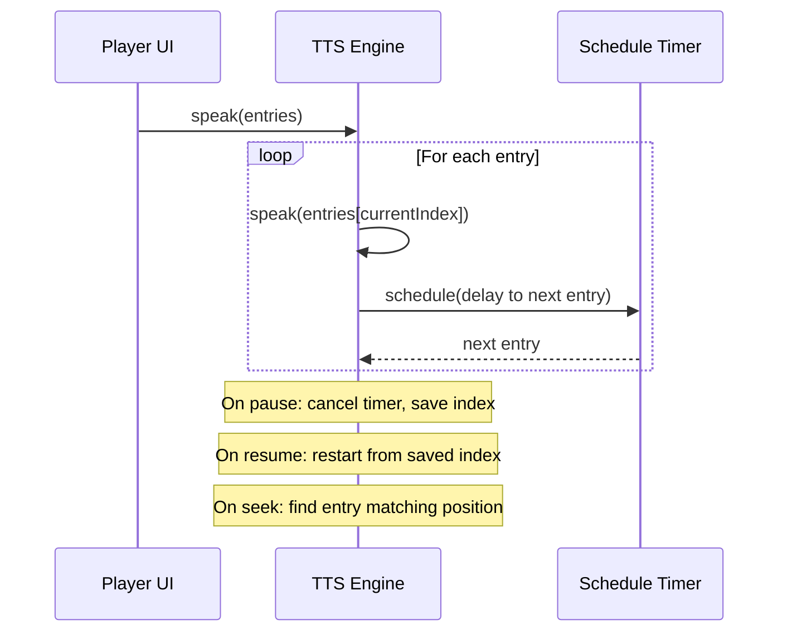
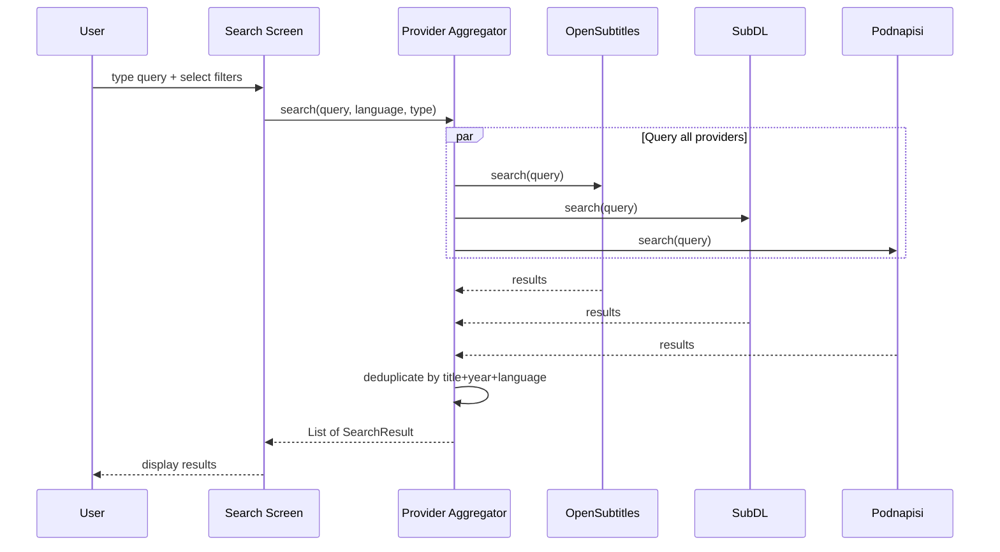
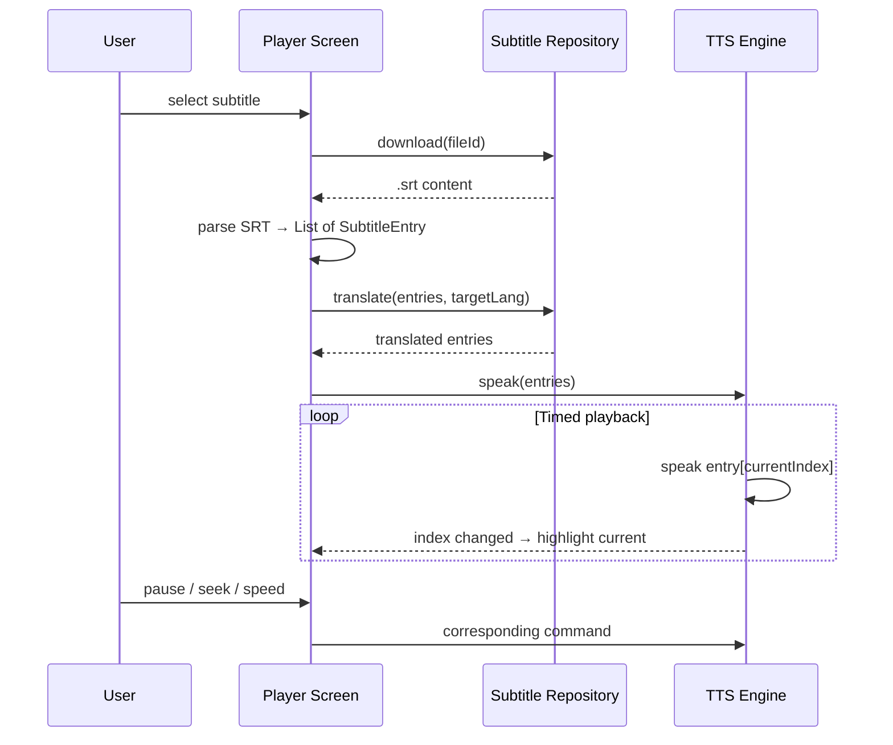

# subvocal — Architecture

**subvocal** is a cross-platform Flutter app that lets users pick subtitles (from
multiple online providers or local `.srt` files) and have them read aloud via TTS
in sync with streaming video (Netflix, Prime, etc.). It also translates subtitles
into the user's target language.

---

## Layer Overview (Clean Architecture)



**Dependency rule**: Source dependencies point inward. The domain layer has zero
Flutter or framework imports. Data and presentation layers implement domain
interfaces.

---

## Subtitle Providers

The app searches multiple subtitle databases simultaneously and deduplicates
results.

### Provider Interface

**File**: `lib/domain/repositories/subtitle_provider.dart`

```dart
abstract class SubtitleProvider {
  String get name;
  Future<(List<SearchResult>?, Failure?)> search(String query, {String? language, String? type});
  Future<(String?, Failure?)> download(dynamic fileId);
  Future<(String?, Failure?)> fetchContent(String url);
}
```

Every provider implements this contract. The domain layer only sees the
interface — it doesn't know which APIs back it.

### Provider Aggregator

**File**: `lib/data/repositories/subtitle_provider_aggregator.dart`

The aggregator queries all configured providers in parallel, merges results, and
deduplicates by title + year + language.



### Supported Providers

| Provider | API | Auth | Free Tier | Notes |
|----------|-----|------|-----------|-------|
| **OpenSubtitles** | REST v1 | API key + optional JWT | 5 downloads/day | Largest database; primary source |
| **SubDL** | REST v1 | API key | 2,000 req/day | TMDB/IMDB lookup; season packs |
| **Podnapisi** | REST | None | Unlimited | 2.2M+ subtitles; 101 languages |

> **Note**: SubDL and Podnapisi are fully implemented but currently disabled in
> the provider wiring. Enabling them requires passing the API instances to
> `SubtitleRepositoryImpl` in `search_provider.dart`.

### Adding a New Provider

1. Create `lib/data/datasources/{name}_api.dart` implementing `SubtitleProvider`
2. Add the API class as an optional parameter to `SubtitleRepositoryImpl`
3. Pass it to `SubtitleProviderAggregator`
4. Wire it in `search_provider.dart` via a new Riverpod provider

---

## Translation Services

Subtitles can be translated into the user's target language. Multiple backends
are chained via a fallback pattern.

### Translation Interface

**File**: `lib/data/datasources/translation_service.dart`

```dart
abstract class TranslationService {
  Future<(String?, Failure?)> translate(String text, String targetLanguage, {String? sourceLanguage});
  Future<(List<String>?, Failure?)> translateBatch(List<String> texts, String targetLanguage, {String? sourceLanguage});
}
```

### Provider Selection

**File**: `lib/presentation/providers/search_provider.dart` (`_translationServiceProvider`)

Translation provider selection has two paths:

1. **Google Translate shortcut** — if `GOOGLE_TRANSLATE_API_KEY` is set, Google
   Translate is used directly (no fallback chain). This is the highest-priority path.
2. **Fallback chain** — otherwise, a `FallbackTranslationService` is built with
   providers in order: Azure (if configured) → MyMemory → Apertium → LibreTranslate.
   The user can also pin a single provider via the Settings screen.

The `FallbackTranslationService` tries each backend in order. If one fails
(non-rate-limit), it moves to the next. If a rate limit is hit, it stops
immediately — the caller decides whether to retry.



### Supported Services

| Service | Auth | Free Tier | Batch | Notes |
|---------|------|-----------|-------|-------|
| **Azure Translate** | subscription key + region | 2M chars/month | Native | Enterprise grade; first in chain if configured |
| **MyMemory** | optional email | 5K chars/day (50K with email) | Join lines | Free; good default |
| **Apertium** | None | Unlimited | Native | Open source; strong for Romance languages |
| **LibreTranslate** | None | Unlimited | Native | Open source; self-hostable |
| **Google Translate** | API key | 100K chars/day | Native | High quality; requires billing account |

### Batch Optimization

- Subtitle entries are grouped in batches of 10
- Batch translation reduces API calls
- Rate limit errors trigger fallback to the next service
- Failed entries fall back to the original (untranslated) text

### Adding a New Service

1. Create `lib/data/datasources/{name}_translate_api.dart` implementing `TranslationService`
2. Add it to the fallback chain in `search_provider.dart` (the `_translationServiceProvider`)

---

## TTS Engine

**File**: `lib/data/repositories/tts_repository_impl.dart`

The TTS engine wraps `flutter_tts` and schedules utterances to match subtitle
timestamps.

### Interface

**File**: `lib/domain/repositories/tts_repository.dart`

```dart
abstract class TtsRepository {
  Future<Failure?> init();
  Future<Failure?> speak(List<SubtitleEntry> entries);
  Future<void> play();
  Future<void> pause();
  Future<void> resume();
  Future<void> seek(Duration position);
  Future<void> stop();
  Future<void> setSpeed(double rate);
  Future<void> setOffset(Duration offset);
  Future<void> setLanguage(String languageCode);
  Future<List<Map<String, String>>> getVoices();
  Future<void> setVoice(Map<String, String> voice);
  // ... streams for index changes and completion
}
```

### Sync Strategy

Subtitles have `start` and `end` timestamps. The player:

1. Loads all subtitle entries in order
2. Speaks entry N
3. Calculates delay = `entries[N+1].start - entries[N].start`
4. Schedules the next utterance after that delay
5. On **pause**: cancels pending timer, remembers current index
6. On **resume**: replays current entry with adjusted remaining time
7. On **seek**: jumps to the entry whose `start <= seekPosition < end`

This creates approximate sync with streaming video. The user can fine-tune with
a sync offset slider (±5s).



---

## Data Flow

### Search Flow



### Playback Flow



---

## SRT Parser

**File**: `lib/domain/services/srt_parser.dart`

Custom parser — SRT format is simple (~100 lines), no external dependency needed.

**Input**: Raw `.srt` string
**Output**: `List<SubtitleEntry>` (index, start `Duration`, end `Duration`, text)

Handles:
- Standard SRT timestamp format: `HH:MM:SS,mmm`
- HTML tags and entities (strips them)
- Numeric character references (`&#NNN;`, `&#xHH;`)
- Malformed entries (skips gracefully)

---

## Persistence

| Store | File | Format | Purpose |
|-------|------|--------|---------|
| Token Storage | `lib/data/datasources/token_storage.dart` | `flutter_secure_storage` | OpenSubtitles JWT + username |
| Saved Translations | `lib/data/datasources/saved_subtitles_local_source.dart` | JSON files | User-saved translated subtitles |
| Recent Subtitles | `lib/data/datasources/recent_subtitles_local_source.dart` | JSON files | Recently opened subtitle history |
| Settings | `lib/presentation/providers/settings_provider.dart` | In-memory only | Speech rate, pitch, voice, translation provider |

> **Known gap**: Settings are not persisted across app restarts.

---

## Error Handling

**File**: `lib/domain/errors/failures.dart`

A sealed `Failure` class hierarchy:

| Failure Type | Example |
|-------------|---------|
| `SrtParseFailure` | Malformed timestamp, empty file |
| `NetworkFailure` | API error, timeout, all services failed |
| `TtsFailure` | TTS engine init failed, playback error |
| `FileAccessFailure` | File not found, permission denied |

All repository and use-case methods return Dart 3 record types:
`(Result?, Failure?)` — no exceptions in the domain layer.

---

## Environment Variables

| Variable | Required | Description |
|----------|----------|-------------|
| `OPENSUBTITLES_API_KEY` | Yes | API key from opensubtitles.com |
| `SUBDL_API_KEY` | No | API key from subdl.com |
| `GOOGLE_TRANSLATE_API_KEY` | No | Google Cloud Translation API key |
| `AZURE_TRANSLATE_API_KEY` | No | Azure Translator subscription key |
| `AZURE_TRANSLATE_REGION` | No | Azure Translator region |
