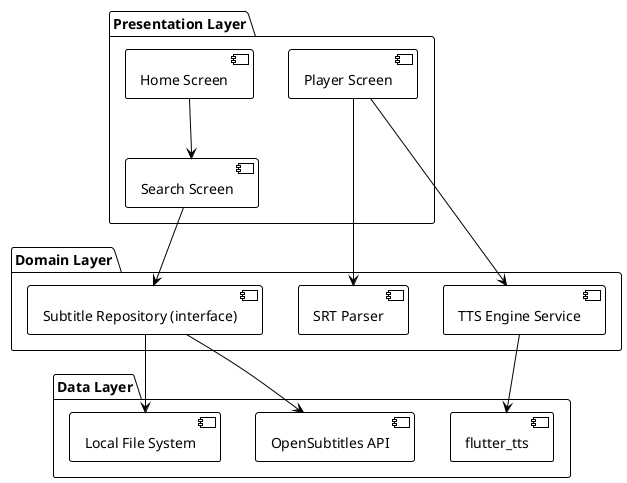

# subvocal — Development Guide

## Overview

**subvocal** is a cross-platform Flutter app that lets users pick subtitles (from
OpenSubtitles or local `.srt` files) and have them read aloud via TTS in sync
with streaming video (Netflix, Prime, etc.).

---

## System Architecture



---

## Directory Structure

```
lib/
├── core/
│   ├── constants/
│   ├── errors/
│   ├── theme/
│   └── utils/
├── data/
│   ├── datasources/
│   │   ├── opensubtitles_api.dart
│   │   └── local_file_source.dart
│   ├── models/
│   └── repositories/
├── domain/
│   ├── entities/
│   ├── repositories/  (abstract)
│   └── usecases/
├── presentation/
│   ├── providers/
│   ├── screens/
│   │   ├── home_screen.dart
│   │   ├── search_screen.dart
│   │   └── player_screen.dart
│   └── widgets/
├── app.dart
└── main.dart
```

---

## Agent Workflow

All code changes follow the HITL workflow described in `AGENTS.md`:

1. **@architect** produces a plan and creates a GitHub issue
2. **Human** reviews and approves (comments `approved` on the issue)
3. **@developer** implements autonomously
4. **@tester** writes/executes tests
5. **@security-auditor** reviews final code

Notifications via ntfy.sh (topic: `subvocal-hitl`).

---

## Development Setup

### Prerequisites

- Flutter SDK 3.x
- GitHub CLI (`gh`)
- OpenSubtitles API key (from https://opensubtitles.com)

### Quick Start

```bash
# Activate opencode profile
node .opencode/merge-config.js opencode

# Get dependencies
flutter pub get

# Run in debug mode
flutter run
```

### VS Code Extensions

The devcontainer installs these automatically:

- **Dart-Code.dart-code** / **Dart-Code.flutter** — Dart/Flutter language support
- **SonarSource.sonarlint-vscode** — real-time linting
- **jebbs.plantuml** — PlantUML diagrams
- **redhat.vscode-yaml** — YAML support
- **eamodio.gitlens** — Git annotations
- **yzhang.markdown-all-in-one** — Markdown preview
- **usernamehw.errorlens** — inline error display

---

## Building

```bash
# Analyze
dart analyze

# Format
dart format .

# Unit + widget tests
flutter test

# APK (debug)
flutter build apk --debug

# APK (release)
flutter build apk --release

# iOS (requires macOS)
flutter build ios
```

---

## Testing

```bash
# Run all tests
flutter test

# Run specific test file
flutter test test/unit/srt_parser_test.dart

# Integration tests (requires emulator/device)
flutter test integration_test/
```

---

## Environment Variables

| Variable | Required | Description |
|----------|----------|-------------|
| `OPENSUBTITLES_API_KEY` | Yes | API key from opensubtitles.com |
| `AI_FUN_TOKEN` | No | GitHub PAT for AI tooling |
| `OPENROUTER_API_KEY` | No | OpenRouter API key for AI |

---

## Code Conventions

- **Clean Architecture**: Domain layer has zero Flutter imports
- **Clean Code**: Small functions, meaningful names, single responsibility
- **Riverpod**: All state through providers; no setState in business logic
- **Dart**: Follow effective_dart style guide
- **Testing**: Unit tests for domain, widget tests for presentation

---

## Project Status

### MVP (Phase 1)
- [ ] Flutter project scaffolding
- [ ] SRT parser
- [ ] OpenSubtitles API integration (search + download)
- [ ] TTS engine service
- [ ] Player screen with controls
- [ ] File import
- [ ] Home screen

### Phase 2
- [ ] Library management
- [ ] Language learning features
- [ ] Voice selection
- [ ] Background playback
- [ ] Additional subtitle formats
