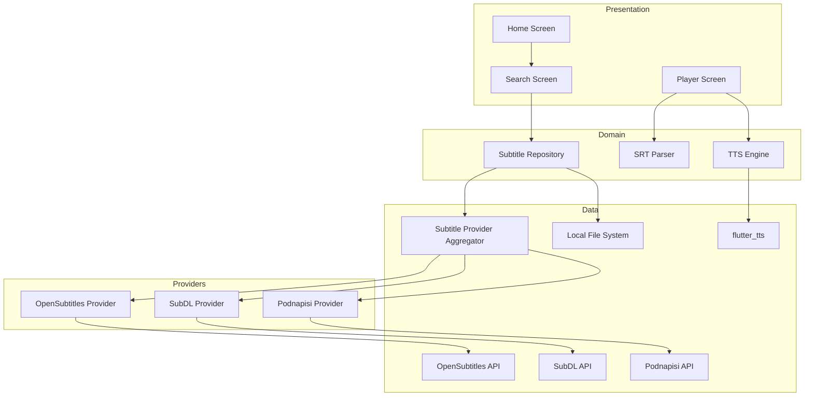

# subvocal — Development Guide

## Overview

**subvocal** is a cross-platform Flutter app that lets users pick subtitles (from
OpenSubtitles or local `.srt` files) and have them read aloud via TTS in sync
with streaming video (Netflix, Prime, etc.).

---

## System Architecture


```mermaid
graph TB
    subgraph Presentation
        HS[Home Screen]
        SS[Search Screen]
        PS[Player Screen]
    end
    subgraph Domain
        SR[Subtitle Repository]
        SP[SRT Parser]
        TTS[TTS Engine]
    end
    subgraph Data
        SA[Subtitle Provider Aggregator]
        OS[OpenSubtitles API]
        SD[SubDL API]
        PN[Podnapisi API]
        LF[Local File System]
        FT[flutter_tts]
    end
    subgraph Providers
        OP[OpenSubtitles Provider]
        SDP[SubDL Provider]
        PNP[Podnapisi Provider]
    end

    HS --> SS
    SS --> SR
    SR --> SA
    SA --> OP
    SA --> SDP
    SA --> PNP
    OP --> OS
    SDP --> SD
    PNP --> PN
    SR --> LF
    PS --> TTS
    PS --> SP
    TTS --> FT
```

---

## Directory Structure

```
lib/
├── core/
│   ├── constants/
│   ├── errors/
│   ├── theme/
│   └── utils/
├── data/
│   ├── datasources/
│   │   ├── opensubtitles_api.dart
│   │   ├── subdl_api.dart
│   │   ├── podnapisi_api.dart
│   │   ├── local_file_source.dart
│   │   └── translation_service.dart
│   ├── models/
│   │   └── search_result_model.dart
│   └── repositories/
│       ├── subtitle_repository_impl.dart
│       └── subtitle_provider_aggregator.dart
├── domain/
│   ├── entities/
│   │   ├── search_result.dart
│   │   ├── subtitle.dart
│   │   └── subtitle_entry.dart
│   ├── repositories/
│   │   ├── subtitle_repository.dart
│   │   └── subtitle_provider.dart
│   └── services/
│       └── srt_parser.dart
├── presentation/
│   ├── providers/
│   │   ├── search_provider.dart
│   │   ├── player_provider.dart
│   │   └── settings_provider.dart
│   ├── screens/
│   │   ├── home_screen.dart
│   │   ├── search_screen.dart
│   │   ├── player_screen.dart
│   │   └── settings_screen.dart
│   └── widgets/
├── app.dart
└── main.dart
```

---

## Agent Workflow

All code changes follow the HITL workflow described in `AGENTS.md`:

1. **@architect** produces a plan and creates a GitHub issue
2. **Human** reviews and approves (comments `approved` on the issue)
3. **@developer** implements autonomously, then returns to architect
4. **@architect** reviews implementation, approves or requests changes
5. **@tester** writes/executes tests, then returns to architect
6. **@architect** reviews tests, approves or requests changes
7. **@security-auditor** reviews code for vulnerabilities, returns to architect
8. **@architect** final review, creates PR and merges

Notifications via ntfy.sh (topic: `subvocal-hitl`).

---

## Development Setup

### Prerequisites

- Flutter SDK 3.x
- GitHub CLI (`gh`)
- OpenSubtitles API key (from https://opensubtitles.com)

### Quick Start

```bash
# Activate opencode profile
node .opencode/merge-config.js opencode

# Get dependencies
flutter pub get

# Run in debug mode
flutter run
```

### VS Code Extensions

The devcontainer installs these automatically:

- **Dart-Code.dart-code** / **Dart-Code.flutter** — Dart/Flutter language support
- **SonarSource.sonarlint-vscode** — real-time linting
- **jebbs.plantuml** — PlantUML diagrams
- **redhat.vscode-yaml** — YAML support
- **eamodio.gitlens** — Git annotations
- **yzhang.markdown-all-in-one** — Markdown preview
- **usernamehw.errorlens** — inline error display

---

## Building

```bash
# Analyze
dart analyze

# Format
dart format .

# Unit + widget tests
flutter test

# APK (debug)
flutter build apk --debug

# APK (release)
flutter build apk --release

# iOS (requires macOS)
flutter build ios
```

---

## Testing

```bash
# Run all tests
flutter test

# Run specific test file
flutter test test/unit/srt_parser_test.dart

# Integration tests (requires emulator/device)
flutter test integration_test/
```

---

## Environment Variables

| Variable | Required | Description |
|----------|----------|-------------|
| `OPENSUBTITLES_API_KEY` | Yes | API key from opensubtitles.com |
| `AI_FUN_TOKEN` | No | GitHub PAT for AI tooling |
| `OPENROUTER_API_KEY` | No | OpenRouter API key for AI |

---

## Code Conventions

- **Clean Architecture**: Domain layer has zero Flutter imports
- **Clean Code**: Small functions, meaningful names, single responsibility
- **Riverpod**: All state through providers; no setState in business logic
- **Dart**: Follow effective_dart style guide
- **Testing**: Unit tests for domain, widget tests for presentation

---

## Subtitle Providers

The app supports multiple subtitle providers through a provider abstraction layer:

### Provider Interface
- **Location**: `lib/domain/repositories/subtitle_provider.dart`
- **Contract**: `search()`, `download()`, `fetchContent()`
- **Benefit**: Easy to add new providers without changing domain logic

### Provider Aggregator
- **Location**: `lib/data/repositories/subtitle_provider_aggregator.dart`
- **Function**: Searches all providers simultaneously, deduplicates results
- **Fallback**: If primary provider fails, tries alternatives

### Supported Providers

| Provider | Auth | Rate Limit | Database | Features |
|----------|------|------------|----------|----------|
| **OpenSubtitles** | API Key | 5/day (free) | Largest | Full API, translation |
| **SubDL** | API Key | 2,000/day | Large | TMDB/IMDB lookup, season packs |
| **Podnapisi** | None | Unlimited | 2.2M+ | 101 languages, zero auth |

### Adding a New Provider

1. Create `lib/data/datasources/{provider}_api.dart`
2. Implement `SubtitleProvider` interface
3. Add to `SubtitleProviderAggregator`
4. Update `SubtitleRepositoryImpl` with optional provider parameter

---

## Project Status

### MVP (Phase 1)
- [ ] Flutter project scaffolding
- [ ] SRT parser
- [ ] OpenSubtitles API integration (search + download)
- [ ] TTS engine service
- [ ] Player screen with controls
- [ ] File import
- [ ] Home screen

### Phase 2
- [ ] Library management
- [ ] Language learning features
- [ ] Voice selection
- [ ] Background playback
- [ ] Additional subtitle formats
